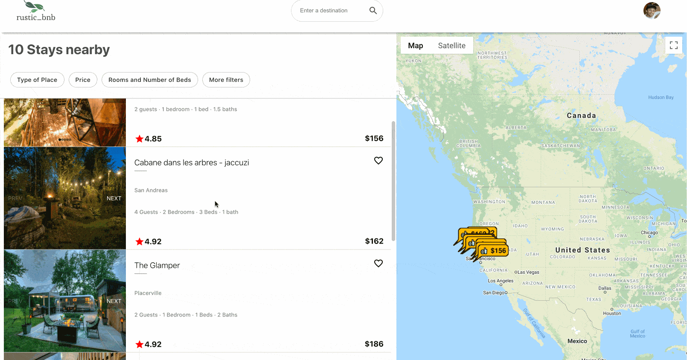

# rustic_bnb - a web app for nature oriented rentals
### **[Visit the Live Site here](https://rustic-bnb.herokuapp.com/)**  
#### Demo Account Details to login:  
email: demo4u@gmail.com<br>
pass: demodemo<br><br>

rustic_bnb is geared for travellers looking to escape the day to day, that are also looking to escape their comfort zone. It uses Express with a MongoDB database on the back-end, and React.js/Redux on the front-end. For image hosting, it utilizes Amazon Web Services.<br>   
## Complete Tech 

1.React/Redux.<br> 
2.Express.<br> 
3.Mongoose/MongoDB <br> 
4.HTML/CSS. <br>
5.Amazon Web Services  
6.Google Maps API. <br>

## Key Features
#### User Authentication 
* Users can sign up or log in with an existing account.  
* Invalid logins or incorrect signup requests will prompt validation errors on both the frontend and the backend.  
* Certain features of the web app will be blocked if users are not logged in, feature implemented using jsonwebtoken.


```
signupRouter.post('/', async(request, response) => {
    const body = request.body

    const saltRounds = 10;
    const passwordHash = await bcrypt.hash(body.password, saltRounds)

    const user = new User({
        firstName: body.firstName,
        lastName: body.lastName,
        email: body.email,
        passwordHash,
    })

    const savedUser = await user.save()

    response.json(savedUser)
})

signupRouter.get('/', async(request, response) => {
    const users = await User.find({})
    response.json(users)
})

module.exports = signupRouter
...
loginRouter.post('/', async(request, response) => {
    const body = request.body

    const user = await User.findOne({email: body.email})

    const passwordCorrect = user === null ? false 
        : await bcrypt.compare(body.password, user.passwordHash)

    if(!(user && passwordCorrect)) {
        return response.status(401).json({
            error: 'invalid username or password'
        })
    }

    // use this information for creating the token, will go in jwt payload
    const userForToken = {
        email: user.email,
        id: user._id
    }

    const token = jwt.sign(userForToken, process.env.SECRET)
```
    
#### Listings
* Listings are updated with the current display of the Google Maps API. Showing the available listings based off of the maps location, if the user goes to an area without any listings, none will be shown.  

```
   useEffect(() => {
        let displayCheck = [];       
        if (map) {     
             if(markers){
                 new window.google.maps.event.addListener(map, 'bounds_changed',  function() {
                    let bounds = map.getBounds()
                         markers.map( (marker) => {
                            if((bounds.contains(marker)) === false ){
                                displayCheck.push(false)
                            } else {
                                displayCheck.push(true)
                            }
                            return displayCheck;
                        })
                        dispatch(updateDisplay(displayCheck))
                        displayCheck=[]
                 });}}
}, [map])}
```

#### Bookings
* Bookings are found under the reservations tab in the users profile tab.   
* Bookings can be scheduled and cancelled if their booking date has not passed.  
* Bookings display review functionality after booking and the date has passed.
* Below is the backend configuration for posting and deleting. 

```
bookingRouter.post('/', async (req, res) => {
    body = req.body;
    const user = await User.findOne({email: body.email}, function(err, user){
        if (err) {
            res.send('No user with that email', err.message)
        }
        return user
    })
    const booking = await new Bookings({
        images: body.images,
        startDate: body.startDate,
        endDate: body.endDate,
        location: body.location,
        locationName: body.locationName,
        price: body.price,
        user: user, 
        id: body.id
    }).save()
    await User.findOneAndUpdate({email: body.email}, {
        $push: {bookings: booking}
    }).populate("bookings")
    res.json(booking)
})
bookingRouter.delete('/', async(req, res) => {
    body = req.body
    var id = mongoose.Types.ObjectId(body.bookingId)
    const deleted = await User.updateOne({email: body.userId},
        {$pull: {'bookings': {'_id':id}}}, {safe: true, multi: true})
    res.status(200).json(deleted)
})
```

#### Reviews 
* Users can leave a review in the forms of stars and comment.
* The listings are then updated to show the aggregate result of the reviews left for a location, including the time at which the posting was made for any comments.  

```
    //gets the date stamp and review
    const reviewList = listing.reviewText.map((reviews,i) => {
        let savedDate = moment(reviews.Date).format('MMMM Do YYYY')
        let review = <div><h5>{savedDate}</h5>{reviews.text}</div>
        return <li key={i}>{review}</li>
    })

    //calculates the average reviews received for each citeria
    const totalReveiew = (data) => data.reduce((a, b) => a + b) / data.length;
    
    const accuracy = totalReveiew(listing.accuracy)
    const communication = totalReveiew(listing.communication)
    const cleanliness = totalReveiew(listing.cleanliness)
    const locationReview = totalReveiew(listing.locationReview)
    const checkIn = totalReveiew(listing.checkIn)
    const value = totalReveiew(listing.value)
```


                    
